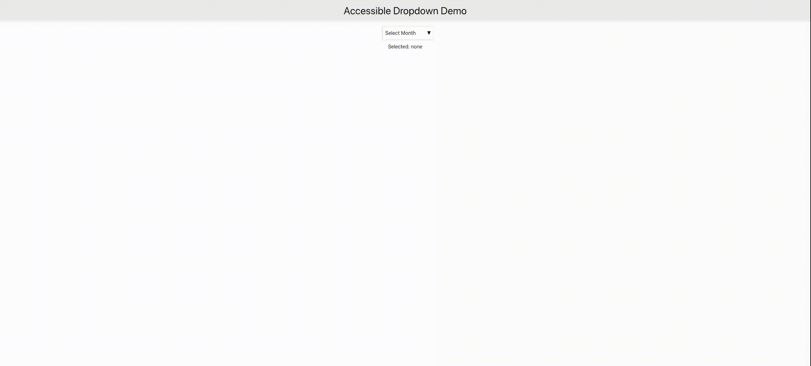

# Accessible Dropdown component with Vue3
A keyboard accessible dropdown component using Vue3  

# Features:  
:heavy_check_mark: Keyboard accessible container  
:heavy_check_mark: Keyboard navigable using arrow keys  
:heavy_check_mark: Uses `vue-click-outside` from `@vueuse/core` to close the drop-down when clicked outside  
:heavy_check_mark: Options selectable using **Space** or **Enter** keys  
:heavy_check_mark: Uses **Esc** key to close the dropdown  

## Quick Start
Local development server:

```
yarn dev
http://localhost:5173
```

# Preview

